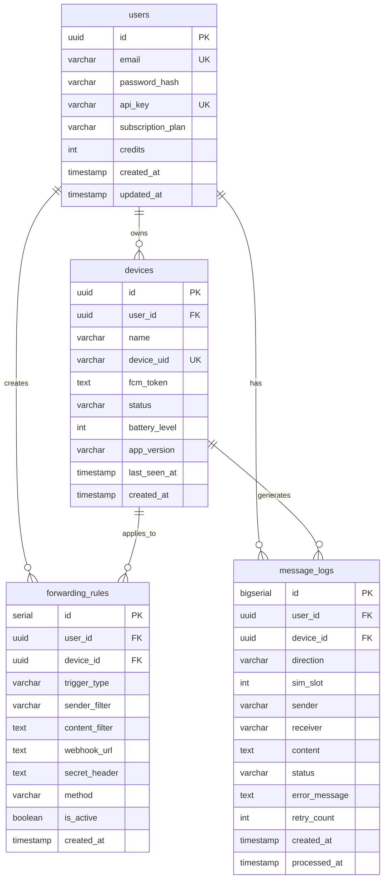

# TingHook MVP - Full Implementation Plan

## 1. Overview

**TingHook** là SaaS platform biến Android devices thành programmable SMS Gateways và Notification Listeners via API/Webhooks.

### Problem Solved
- Businesses cần gửi/nhận SMS programmatically nhưng không muốn dùng SMS API đắt tiền
- Developers cần forward notifications từ apps khác sang hệ thống của họ
- Cần solution real-time, low-cost, self-hosted capable

### Success Metrics
- [ ] Backend API xử lý 1000 req/min
- [ ] WebSocket stable với 100 concurrent devices
- [ ] Android app chạy foreground service 24/7 không bị kill
- [ ] Dashboard responsive, load < 2s

## 2. Goals

1. **Backend:** RESTful API + WebSocket hub với Golang/Fiber
2. **Frontend:** Dashboard SvelteKit với real-time updates
3. **Android:** Native app với Kotlin + C++ core
4. **Infrastructure:** Docker Compose cho local dev + production ready

## 3. User Stories

### Authentication
- As a user, I want to register/login so that I can access the dashboard
- As a user, I want an API key so that I can authenticate external API calls

### Device Management
- As a user, I want to pair my Android device via QR code so that setup is easy
- As a user, I want to see device status (online/offline/battery) in real-time

### SMS Gateway
- As a user, I want to send SMS via API so that I can integrate with my systems
- As a user, I want to receive SMS and forward to webhook so that I can automate workflows

### Notification Listener
- As a user, I want to capture notifications from specific apps
- As a user, I want to forward notifications to webhook with filters

### Forwarding Rules
- As a user, I want to create rules with sender/content filters
- As a user, I want to configure webhook URLs with custom headers

### Logs & History
- As a user, I want to see message history with status
- As a user, I want real-time log streaming in dashboard

## 4. Functional Requirements

### 4.1 Backend (Golang)

#### Authentication
1. System must support user registration with email/password
2. System must hash passwords with bcrypt
3. System must issue JWT tokens on login
4. System must validate JWT on protected routes
5. System must generate unique API keys per user

#### Device Management
1. System must register devices with unique device_uid
2. System must track device status (online/offline)
3. System must update FCM tokens for push notifications
4. System must track battery level and app version
5. System must update last_seen_at on heartbeat

#### WebSocket Hub
1. System must maintain persistent connections with devices
2. System must authenticate WebSocket connections via API key
3. System must route commands to specific devices
4. System must handle reconnection gracefully
5. System must implement ping/pong heartbeat (30s interval)

#### SMS API
1. System must accept SMS send requests via REST API
2. System must validate API key from header
3. System must check user quota before processing
4. System must queue SMS to target device via WebSocket
5. System must log all SMS with status tracking

#### Webhook Dispatcher
1. System must process forwarding rules on incoming events
2. System must match sender/content filters (regex support)
3. System must dispatch webhooks via Asynq background worker
4. System must retry failed webhooks (max 3, exponential backoff)
5. System must update message log status after dispatch

#### Subscription & Quotas
1. System must enforce device limits per plan
2. System must append signature for free tier SMS
3. System must rate limit API calls per tier

### 4.2 Frontend (SvelteKit)

#### Pages
1. Landing page with feature overview
2. Login/Register forms with validation
3. Dashboard overview with device stats
4. Device list with real-time status
5. QR code generator for device pairing
6. Forwarding rules CRUD interface
7. Message logs with pagination and filters
8. API documentation page

#### Real-time Features
1. WebSocket connection for live updates
2. Real-time device status changes
3. Live log streaming console
4. Toast notifications for events

### 4.3 Android Client (Kotlin + C++)

#### Core Services
1. Foreground service with persistent notification
2. SMS broadcast receiver
3. Notification listener service
4. Background work manager for reliability

#### Native Engine (C++)
1. WebSocket client with auto-reconnect
2. JSON serialization with nlohmann/json
3. Event queue management
4. Secure credential storage

#### Features
1. QR code scanner for pairing
2. Permission request flow (SMS, Notifications)
3. Battery optimization bypass request
4. Connection status indicator
5. Manual reconnect button

## 5. Non-Goals (Out of Scope for MVP)

- Multi-language support (English only)
- Payment integration (manual subscription)
- iOS client
- Voice call handling
- MMS support
- End-to-end encryption
- Team collaboration features
- Audit logs
- Two-factor authentication

## 6. Open Questions

1. **FCM:** Có cần push notification để wake up device không?
2. **Rate Limiting:** Dùng Redis rate limiter hay in-memory?
3. **Deployment:** Target cloud provider nào? (VPS, AWS, GCP)

---

## 7. Technical Design

### 7.1 Project Structure

```
tinghook-project/
├── backend/                 # Golang backend
│   ├── cmd/server/
│   │   └── main.go
│   ├── internal/
│   │   ├── config/
│   │   ├── models/
│   │   ├── handlers/
│   │   ├── repository/
│   │   ├── services/
│   │   ├── websockets/
│   │   ├── workers/
│   │   └── middleware/
│   ├── pkg/utils/
│   ├── migrations/
│   ├── Dockerfile
│   └── go.mod
│
├── frontend/                # SvelteKit dashboard
│   ├── src/
│   │   ├── routes/
│   │   ├── lib/
│   │   │   ├── components/
│   │   │   ├── stores/
│   │   │   └── api/
│   │   └── app.html
│   ├── Dockerfile
│   └── package.json
│
├── android/                 # Android client
│   ├── app/
│   │   ├── src/main/
│   │   │   ├── java/com/tinghook/gateway/
│   │   │   ├── cpp/
│   │   │   └── res/
│   │   └── build.gradle.kts
│   └── build.gradle.kts
│
├── docker-compose.yml
├── plans/
└── README.md
```

### 7.2 Data Model



### 7.3 API Endpoints

#### Auth
| Method | Endpoint | Description |
|--------|----------|-------------|
| POST | `/api/auth/register` | Register new user |
| POST | `/api/auth/login` | Login, returns JWT |
| GET | `/api/auth/me` | Get current user info |
| POST | `/api/auth/refresh-key` | Regenerate API key |

#### Devices
| Method | Endpoint | Description |
|--------|----------|-------------|
| GET | `/api/devices` | List user's devices |
| GET | `/api/devices/:id` | Get device details |
| PUT | `/api/devices/:id` | Update device name |
| DELETE | `/api/devices/:id` | Remove device |
| GET | `/api/devices/pairing-token` | Get QR pairing data |

#### Forwarding Rules
| Method | Endpoint | Description |
|--------|----------|-------------|
| GET | `/api/rules` | List rules |
| POST | `/api/rules` | Create rule |
| PUT | `/api/rules/:id` | Update rule |
| DELETE | `/api/rules/:id` | Delete rule |
| POST | `/api/rules/:id/test` | Test webhook |

#### Message Logs
| Method | Endpoint | Description |
|--------|----------|-------------|
| GET | `/api/logs` | List logs (paginated) |
| GET | `/api/logs/:id` | Get log details |
| GET | `/api/logs/stats` | Get statistics |

#### Public API (External)
| Method | Endpoint | Description |
|--------|----------|-------------|
| POST | `/api/v1/sms/send` | Send SMS (API Key auth) |
| GET | `/api/v1/devices/status` | Get devices status |

#### WebSocket
| Endpoint | Description |
|----------|-------------|
| `WS /ws/device` | Device connection (API Key + Device UID) |
| `WS /ws/dashboard` | Dashboard live updates (JWT) |

### 7.4 WebSocket Protocol

```json
// Device -> Server: Authentication
{ "type": "AUTH", "data": { "api_key": "...", "device_uid": "..." } }

// Server -> Device: Auth Result
{ "type": "AUTH_OK", "data": { "device_id": "uuid" } }
{ "type": "AUTH_FAIL", "data": { "error": "Invalid API key" } }

// Device -> Server: Heartbeat
{ "type": "PING", "data": { "battery": 85, "signal": 4 } }

// Server -> Device: Heartbeat Response
{ "type": "PONG" }

// Device -> Server: SMS Received
{ "type": "SMS_RECEIVED", "data": { 
    "sender": "+84901234567", 
    "content": "Your OTP is 123456",
    "sim_slot": 0,
    "timestamp": "2025-01-01T12:00:00Z"
}}

// Device -> Server: Notification Received
{ "type": "NOTIFICATION_RECEIVED", "data": {
    "app_package": "com.whatsapp",
    "app_name": "WhatsApp",
    "title": "New message",
    "content": "Hello world",
    "timestamp": "2025-01-01T12:00:00Z"
}}

// Server -> Device: Send SMS Command
{ "type": "SEND_SMS", "data": {
    "request_id": "uuid",
    "phone": "+84901234567",
    "content": "Hello from TingHook",
    "sim_slot": 0
}}

// Device -> Server: SMS Send Result
{ "type": "SMS_SENT", "data": { "request_id": "uuid", "success": true } }
{ "type": "SMS_FAILED", "data": { "request_id": "uuid", "error": "No signal" } }
```

### 7.5 Security Considerations

1. **Password Hashing:** bcrypt with cost 12
2. **JWT:** HS256, 24h expiry, rotate signing key monthly
3. **API Key:** 64-char random string, stored hashed in DB
4. **WebSocket Auth:** Validate API key on connection, disconnect on invalid
5. **Rate Limiting:** Per-user, per-endpoint limits via Redis
6. **Input Validation:** Sanitize all inputs, use parameterized queries
7. **CORS:** Whitelist frontend domain only
8. **HTTPS:** Mandatory in production

### 7.6 Performance Considerations

1. **Connection Pool:** PostgreSQL max 50 connections
2. **Redis Caching:** Cache user/device lookups (5min TTL)
3. **WebSocket:** Use goroutine per connection with proper cleanup
4. **Background Jobs:** Asynq with 10 concurrent workers
5. **Database Indexes:**
   - `users.email`, `users.api_key`
   - `devices.device_uid`, `devices.user_id`
   - `message_logs.user_id`, `message_logs.created_at`
   - `forwarding_rules.user_id`, `forwarding_rules.device_id`

### 7.7 Risk Assessment

| Risk | Impact | Mitigation |
|------|--------|------------|
| Android app killed by OS | High | Foreground service, battery optimization bypass, WorkManager |
| WebSocket disconnection | Medium | Auto-reconnect with exponential backoff, offline queue |
| Webhook target down | Low | Retry with backoff, dead letter queue |
| Database overload | Medium | Connection pooling, query optimization, read replicas |
| API key leak | High | Rate limiting, key rotation, audit logs |

---

## 8. Implementation Phases

### Phase 1: Infrastructure Setup (Day 1-2)
- [ ] Docker Compose với PostgreSQL, Redis
- [ ] Backend project skeleton (Golang/Fiber)
- [ ] Frontend project skeleton (SvelteKit)
- [ ] Android project skeleton (Kotlin + CMake)
- [ ] Database migrations

### Phase 2: Backend Core (Day 3-7)
- [ ] User model + repository
- [ ] Auth handlers (register, login, JWT)
- [ ] Device model + repository
- [ ] WebSocket hub implementation
- [ ] Device WebSocket handler
- [ ] Forwarding rules CRUD
- [ ] Message logs CRUD
- [ ] SMS send API endpoint
- [ ] Asynq webhook worker
- [ ] Unit tests cho services
- [ ] Integration tests cho handlers

### Phase 3: Frontend Dashboard (Day 8-12)
- [ ] Auth pages (login, register)
- [ ] Layout + navigation
- [ ] Dashboard overview
- [ ] Device list + status
- [ ] QR code pairing
- [ ] Forwarding rules UI
- [ ] Message logs UI
- [ ] Real-time WebSocket
- [ ] API docs page
- [ ] Responsive design

### Phase 4: Android Client (Day 13-18)
- [ ] Project setup với CMake
- [ ] C++ WebSocket client
- [ ] JNI bridge implementation
- [ ] Foreground service
- [ ] SMS broadcast receiver
- [ ] Notification listener
- [ ] QR scanner
- [ ] Permission flow
- [ ] UI với connection status
- [ ] Unit tests

### Phase 5: Integration & Testing (Day 19-21)
- [ ] End-to-end testing
- [ ] Performance testing
- [ ] Security audit
- [ ] Bug fixes
- [ ] Documentation

---

## 9. Dependencies

### Backend (go.mod)
```
github.com/gofiber/fiber/v2
github.com/gofiber/contrib/websocket
github.com/golang-jwt/jwt/v5
gorm.io/gorm
gorm.io/driver/postgres
github.com/redis/go-redis/v9
github.com/hibiken/asynq
golang.org/x/crypto/bcrypt
github.com/google/uuid
```

### Frontend (package.json)
```
@sveltejs/kit
svelte
tailwindcss
bits-ui (or shadcn-svelte)
@tanstack/svelte-query
lucide-svelte
qrcode
```

### Android (build.gradle)
```
androidx.core:core-ktx
androidx.work:work-runtime-ktx
com.google.mlkit:barcode-scanning
```

### Android C++ (CMakeLists.txt)
```
nlohmann_json
```
